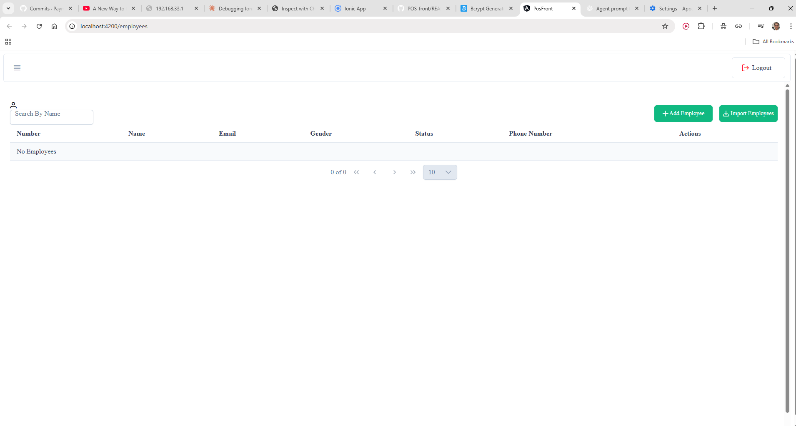

/# PosFront

A standalone Angular (v20) Point-of-Sale front-end application using PrimeNG. PosFront provides a lightweight UI for managing employees and basic POS workflows with optional server-side rendering (SSR) support.

## Description
PosFront is a frontend app built with Angular standalone components and PrimeNG. It provides employee management UI, routing, and theming (light/dark) support. Designed to be integrated with a REST API backend.

## Features
- Employee list, create, edit, delete (UI)
- Responsive layout with PrimeNG Drawer and Menubar
- Light / Dark theme toggle (PrimeNG theme support)
- Standalone Angular components (no NgModule)
- Optional SSR entry (server.ts) for server-side rendering
- Built-in unit test setup
  
## Screenshots

### Screenshots (placeholder)



## Tech Stack
- Angular 20 (standalone components)
- PrimeNG (UI components & themes)
- TypeScript
- Node.js / npm (build & dev server)
- Optional SSR (Node server entry: src/server.ts)

## Installation
Clone and install dependencies:

```bash
git clone <repo-url>
cd pos-front
npm install
```

Start development server (live reload):

```bash
npm run start
# open http://localhost:4200
```

Common scripts:
```bash
npm run start        # dev server
npm run build        # production build
npm run watch        # dev watch build
npm run test         # run unit tests
npm run serve:ssr:pos-front  # run built SSR server (if available)
```

## Project Structure
- src/
  - app/
    - app.ts            — Root standalone component (App)
    - app.html, app.css — Root template & styles
    - services/         — API services (e.g., EmployeeService)
    - shared/           — shared models and utilities (e.g., baseUrl)
  - main.ts             — Application bootstrap (providePrimeNG options)
  - server.ts           — SSR server entry (optional)
- angular.json          — Angular build & config
- package.json          — Scripts & dependencies
- docs/screenshots/     — (suggested) screenshots folder for README images

## Usage
- Use the menubar to open the drawer and access the Employees UI.
- The Employees button navigates to `/employees`.
- Toggle dark mode via the app control — PrimeNG expects a theme selector (configured in main.ts). Ensure the configured selector class (e.g., `.my-app-dark`) is applied to the HTML element or use PrimeNG theme API.

Example: run dev + debug in VS Code (Windows):
1. npm run start
2. Attach debugger using the workspace .vscode launch configuration or open http://localhost:4200 in browser devtools.

## Environment Variables
This project uses Angular environments and may reference a base API URL in:
- src/environments/environment.ts
- src/environments/environment.prod.ts
or a local file:
- src/app/shared/models/baseUrl.ts

Common environment keys (adjust to your backend):
- API_BASE_URL or BASE_URL — e.g., https://api.example.com
If you use a .env approach for SSR or Node server, document variables in server README or .env.example.

## API Endpoints (example)
If integrated with a REST backend, the app expects typical employee endpoints. Adjust paths to match your backend.

- GET /api/employees         — list employees
- GET /api/employees/:id     — get employee
- POST /api/employees        — create employee
- PUT /api/employees/:id     — update employee
- DELETE /api/employees/:id  — delete employee

Check src/app/services/employee.ts for the actual endpoints and base URL used.


## Contributing
- Fork the repo and open a PR.
- Follow existing code patterns (standalone components).
- Run tests: npm test
- Add screenshots to docs/screenshots and update README as needed.

## License
MIT — see LICENSE file or add one if missing.
```
